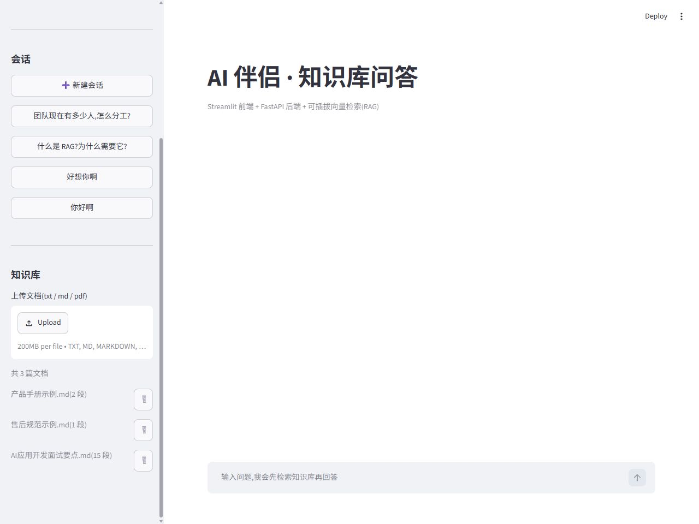
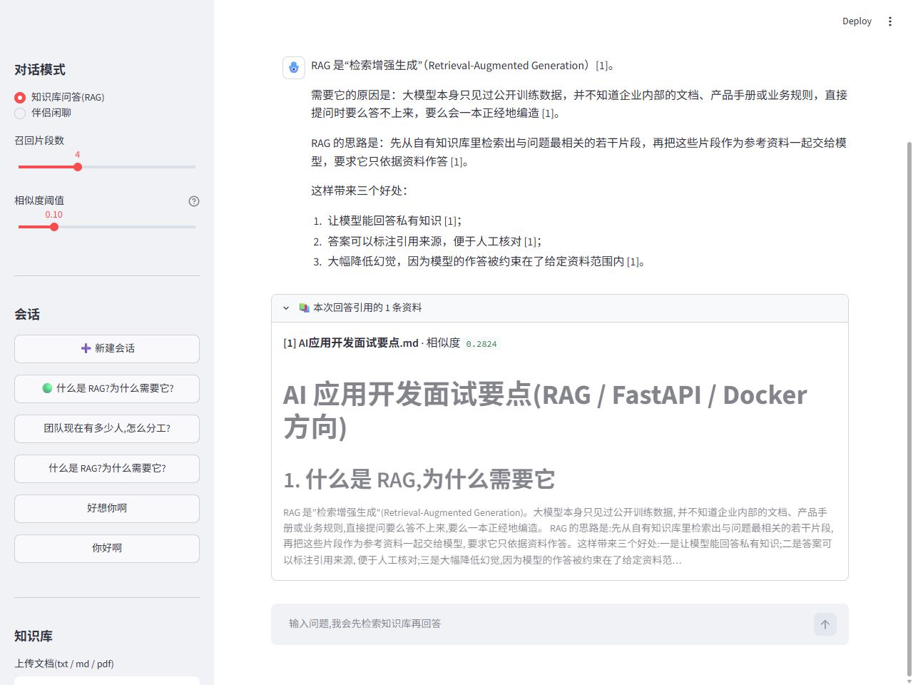
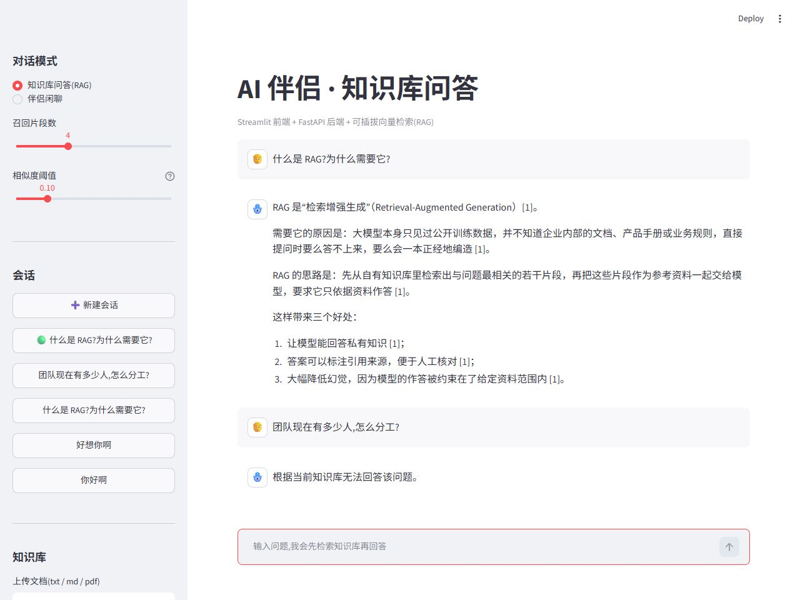

# AI 伴侣 · RAG 知识库问答

一个把大模型能力**工程化落地**的示例项目:在原有「AI 角色扮演聊天应用」的基础上,拆分为
**FastAPI 后端 + Streamlit 前端**,并加入 **RAG 检索增强**与 **Docker 容器化部署**。

后端提供标准的 HTTP 接口(自带 Swagger 文档),前端只负责界面;知识库可上传文档并自动切分建索引,
提问时先检索相关片段再交给大模型作答,并返回**引用来源**。

---

## 界面预览

**① 知识库管理** —— 上传 txt / markdown / pdf 文档,后端自动切分并建立索引,可随时删除并重建



**② 检索增强问答** —— 回答中标注引用编号,可展开查看命中的原文片段与相似度分数



**③ 无法回答时明确拒答** —— 知识库里没有相关内容时,不会被硬塞一段无关片段交给模型,而是直接说明无法回答(上方是能答的、下方是答不了的,形成对比)



---

## 一、技术栈

| 层次 | 技术 |
| --- | --- |
| 后端服务 | FastAPI、Pydantic、Uvicorn |
| 前端界面 | Streamlit |
| 大模型 | OpenAI SDK(OpenAI 兼容协议,默认接入 DeepSeek) |
| 检索增强 | 自实现向量化 + 向量库(稀疏向量 / 可插拔稠密向量) |
| 文档解析 | pypdf(txt / markdown / pdf) |
| 数据存储 | JSON + NumPy 二进制索引(本地文件,免数据库) |
| 部署 | Docker、Docker Compose |
| 测试 | pytest 单元测试 + 端到端冒烟测试 |

---

## 二、系统架构

```
┌────────────────────┐        HTTP / SSE         ┌──────────────────────────────┐
│  Streamlit 前端     │ ────────────────────────▶ │  FastAPI 后端                 │
│  ui/streamlit_app.py│                          │  app/api/main.py             │
│  · 对话界面          │ ◀──────────────────────── │  · /chat、/chat/stream(SSE)   │
│  · 知识库上传/管理    │        事件流 / JSON       │  · /kb/* 知识库管理            │
└────────────────────┘                          └──────────────┬───────────────┘
                                                                │
         ┌──────────────────────────────────────────────────────┼───────────────────────┐
         ▼                                                      ▼                       ▼
┌─────────────────┐   ┌──────────────────┐   ┌──────────────────┐   ┌──────────────────────┐
│ 文档加载         │   │ 文本切分          │   │ 向量化 + 向量库   │   │ 大模型客户端           │
│ rag/loader.py   │──▶│ rag/splitter.py  │──▶│ rag/embedder.py  │──▶│ llm.py               │
│ txt/md/pdf      │   │ 段落聚合 + 重叠    │   │ rag/store.py     │   │ 流式输出 / 异常翻译     │
└─────────────────┘   └──────────────────┘   └──────────────────┘   └──────────────────────┘
                                                       │
                                               data/index/(索引持久化)
```

一次 RAG 问答的完整链路:

```
用户提问
   │
   ├─▶ 1. 检索:把问题向量化,与索引中所有片段做余弦相似度,取 Top-K 并过滤低分片段
   │
   ├─▶ 2. 拼装提示词:把命中片段编号后填入 system prompt,要求模型「只依据资料回答 + 标注引用编号」
   │
   ├─▶ 3. 生成:调用大模型流式接口,逐块返回增量文本(SSE 推给前端)
   │
   └─▶ 4. 落库:用户问题与模型回答写入会话 JSON,并返回引用来源列表
```

---

## 三、核心特性

- **RAG 检索问答**:文档自动切分建索引,回答附带引用来源与相似度,资料不足时明确说"无法回答"而非编造。
- **可插拔向量化层**:默认使用本地稀疏向量(字符 n-gram + TF-IDF,离线零依赖);配置 `EMBEDDING_BACKEND=api`
  即可切换为真实 embedding 模型,上层检索逻辑无需改动。
- **SSE 流式输出**:`/api/v1/chat/stream` 逐字推送,前端打字机效果;事件带类型标识,便于前端增量渲染。
- **知识库管理**:上传 / 列表 / 删除文档,删除时同步清理片段并重建索引。
- **会话持久化**:多会话保存为 JSON,支持历史回溯与继续对话。
- **分层架构**:接口层、服务层、RAG 层、模型层职责分离,便于替换实现与单独测试。
- **健壮性**:统一异常翻译(Key 无效 / 余额不足 / 限流 / 超时 / 网络异常)、索引损坏自动重建、原子写入防止存档损坏。
- **离线演示模式**:`MOCK_LLM=true` 时无需 API Key 即可跑通完整链路,方便本地开发与 CI。
- **容器化部署**:`docker compose up --build` 一条命令拉起 API 与前端两个服务。

---

## 四、快速开始

### 方式一:本地运行

```bash
# 1. 安装依赖
pip install -r requirements.txt

# 2. 配置环境变量(复制模板后填入自己的 Key)
cp .env.example .env          # Windows: copy .env.example .env

# 3. 启动后端(终端 1)
uvicorn app.api.main:app --reload --port 8000

# 4. 启动前端(终端 2)
streamlit run ui/streamlit_app.py
```

- 前端界面: http://127.0.0.1:8501
- 接口文档(Swagger): http://127.0.0.1:8000/docs

没有 API Key 时,把 `.env` 里的 `MOCK_LLM` 改成 `true`,即可用模拟回答体验完整流程。

### 方式二:Docker Compose

```bash
# 在项目根目录创建 .env,至少填好 DEEPSEEK_API_KEY(或 MOCK_LLM=true)
docker compose up --build
```

启动后同样访问 `8501`(界面)与 `8000/docs`(接口文档);`data/` 目录通过 volume 挂载,
容器重建不会丢失知识库索引与会话记录。

---

## 五、API 接口

| 方法 | 路径 | 说明 |
| --- | --- | --- |
| GET | `/health` | 健康检查(模型可用性 + 知识库统计) |
| GET | `/api/v1/kb/documents` | 知识库文档列表 |
| POST | `/api/v1/kb/documents` | 上传文档(txt / md / pdf,multipart) |
| POST | `/api/v1/kb/documents/text` | 直接提交文本入库 |
| DELETE | `/api/v1/kb/documents/{doc_id}` | 删除文档并重建索引 |
| POST | `/api/v1/kb/search` | 检索调试(返回命中片段与相似度) |
| POST | `/api/v1/chat` | 问答(非流式) |
| POST | `/api/v1/chat/stream` | 问答(SSE 流式) |
| GET | `/api/v1/sessions` | 会话列表 |
| GET | `/api/v1/sessions/{id}` | 会话详情 |
| DELETE | `/api/v1/sessions/{id}` | 删除会话 |

### 使用示例

```bash
# 1. 上传文档
curl -X POST http://127.0.0.1:8000/api/v1/kb/documents \
     -F "file=@产品手册.pdf"

# 2. 直接检索(排查召回效果)
curl -X POST http://127.0.0.1:8000/api/v1/kb/search \
     -H "Content-Type: application/json" \
     -d '{"query": "退货要几天之内", "top_k": 3}'

# 3. 非流式问答
curl -X POST http://127.0.0.1:8000/api/v1/chat \
     -H "Content-Type: application/json" \
     -d '{"question": "单个文件大小限制是多少", "mode": "rag"}'

# 4. 流式问答(SSE)
curl -N -X POST http://127.0.0.1:8000/api/v1/chat/stream \
     -H "Content-Type: application/json" \
     -d '{"question": "删除文档会怎样", "mode": "rag"}'
```

流式接口的事件格式:

```
data: {"type": "sources", "sources": [{"title": "产品手册", "score": 0.83, ...}]}
data: {"type": "delta", "text": "根据"}
data: {"type": "delta", "text": "产品手册"}
data: {"type": "done", "session_id": "2026-09-13_20-21-22_aff5", "answer": "..."}
data: [DONE]
```

`mode` 参数支持两种模式:`rag`(知识库问答,默认)与 `chat`(角色扮演闲聊,按 `nickname`/`character` 设定人设)。

---

## 六、RAG 实现说明

**1. 文本切分(`rag/splitter.py`)**

不做简单定长切片,而是先按空行切段落、按顺序装进不超过 `chunk_size` 的块,
超长段落再硬切并保留 `chunk_overlap` 重叠,避免答案正好落在切口上。每个块保留在原文中的位置,
便于后续做引用溯源。

**2. 向量化(`rag/embedder.py`)**

抽象出 `BaseEmbedder` 接口,内置两种实现:

- `HashingNgramEmbedder`(默认):字符 1-2 gram + 子线性 TF + IDF,再用哈希技巧压到固定维度并做 L2 归一化。
  对中文不需要分词即可召回,完全离线、可复现(用 `blake2b` 而非 Python 内置 `hash`,不受进程随机种子影响)。
- `ApiEmbedder`:调用 OpenAI 兼容的 embeddings 接口(如 BAAI/bge-m3),具备语义泛化能力。

**3. 向量库(`rag/store.py`)**

索引持久化为 `index.json`(元数据 + 向量化后端状态)与 `vectors.npy`(归一化向量矩阵)。
所谓"向量库"在这里刻意保持轻量:语料规模不大时,余弦相似度直接矩阵点积即可,
但接口(增/删/查/持久化)与真实向量库保持一致,后续替换成 FAISS / Milvus 时上层不用改。

**4. 提示词约束(`services/chat_service.py`)**

把召回片段编号后填入 system prompt,并明确要求:只依据资料作答、标注引用编号、资料不足时直接说明无法回答。
这条约束是 RAG 能否"可信"的关键 —— 不做约束的模型会用自身知识补全,反而更容易产生幻觉。

---

## 七、配置项

| 环境变量 | 默认值 | 说明 |
| --- | --- | --- |
| `DEEPSEEK_API_KEY` | 空 | 大模型 API Key |
| `LLM_BASE_URL` | `https://api.deepseek.com` | 兼容 OpenAI 协议的服务地址 |
| `LLM_MODEL` | `deepseek-v4-pro` | 模型名 |
| `LLM_TEMPERATURE` | `1.0` | 采样温度 |
| `MOCK_LLM` | `false` | 离线演示模式,无需 Key |
| `EMBEDDING_BACKEND` | `hash` | `hash`(本地) / `api`(远程 embedding) |
| `EMBEDDING_DIM` | `4096` | 稀疏向量维度 |
| `CHUNK_SIZE` / `CHUNK_OVERLAP` | `400` / `80` | 切分粒度与重叠长度 |
| `TOP_K` | `4` | 默认召回条数 |
| `SCORE_THRESHOLD` | `0.10` | 相似度过滤阈值(依据评测集实测标定) |
| `HISTORY_ROUNDS` | `10` | 携带的历史对话轮数 |
| `DATA_DIR` | `./data` | 数据根目录 |
| `API_BASE` | `http://127.0.0.1:8000` | 前端访问后端的地址 |

阈值 `SCORE_THRESHOLD` 与向量维度 `EMBEDDING_DIM` 都是**实测调出来的**:维度从 1024 提到 4096 后,
无关问题的相似度从 0.058 降到 0.023,相关与无关问题的分数差距明显拉开;
在此基础上用评测集扫了一遍阈值(见「检索质量评测」),最终取 **0.10** —— 在不牺牲 Top-1 命中率的前提下,
把无关问题的拒答率从 0% 提升到 83.3%。

> 注意:后端的默认值会通过 `/health` 接口下发给前端,前端滑块据此初始化,
> 因此修改 `SCORE_THRESHOLD` 后不需要再改前端代码。

---

## 八、项目结构

```
ai-companion-rag/
├── app/
│   ├── config.py               # 集中配置(全部来自环境变量)
│   ├── schemas.py              # Pydantic 请求/响应模型
│   ├── llm.py                  # 大模型客户端(流式 + 异常翻译 + 离线模拟)
│   ├── rag/
│   │   ├── loader.py           # 文档解析(txt / md / pdf)
│   │   ├── splitter.py         # 文本切分
│   │   ├── embedder.py         # 向量化后端(本地 / API)
│   │   └── store.py            # 向量库(持久化 + 检索)
│   ├── services/
│   │   ├── session_service.py  # 会话持久化
│   │   ├── kb_service.py       # 知识库管理
│   │   └── chat_service.py     # RAG 对话编排
│   └── api/
│       └── main.py             # FastAPI 入口与路由
├── ui/streamlit_app.py         # Streamlit 前端
├── data/
│   ├── knowledge/              # 示例知识库文档
│   ├── index/                  # 向量索引(运行时生成)
│   └── sessions/               # 会话记录(运行时生成)
├── tests/                      # pytest 单元测试
├── scripts/smoke_test.py       # 端到端冒烟测试
├── Dockerfile
├── docker-compose.yml
├── requirements.txt
└── .env.example
```

---

## 九、测试

```bash
# 单元测试:切分、向量化、向量库、知识库服务
pip install -r requirements-dev.txt
pytest tests -q

# 端到端冒烟测试:真实启动服务,验证 上传 -> 检索 -> 问答 -> 流式 -> 删除 全链路
python scripts/smoke_test.py
```

冒烟测试不需要 API Key(`MOCK_LLM=true`),因此可以直接跑在 CI 里。
目前单元测试 18 个用例,覆盖切分边界、向量归一化、检索命中、索引持久化、文档删除等关键行为。

### 检索质量评测

`data/eval/test_questions.csv` 是一份 **24 条问题的评测集**(18 条知识库内的问题 + 6 条故意超出知识库范围的问题),
配套脚本会自动导入文档、逐条检索并统计指标:

```bash
python scripts/eval_retrieval.py                  # 用配置里的阈值
python scripts/eval_retrieval.py --threshold 0.08 # 手动指定阈值做对比
```

评测指标有两类,缺一不可:

- **召回率**:知识库里确实有的问题,能不能把对的片段检索出来(Top-1 / Top-3 命中率);
- **拒答率**:知识库里没有的问题,能不能被阈值拦住,而不是硬塞一段无关内容给模型(这直接决定会不会产生幻觉)。

实测结果(3 篇文档 / 18 个片段,本地稀疏向量,维度 4096):

| 相似度阈值 | Top-1 命中率 | Top-3 命中率 | 无答案问题拒答率 |
| --- | --- | --- | --- |
| 0.05 | 83.3% | 94.4% | 0.0% |
| 0.08 | 83.3% | 88.9% | 50.0% |
| **0.10(默认)** | **83.3%** | **83.3%** | **83.3%** |
| 0.12 | 61.1% | 61.1% | 100.0% |

**结论与取舍**:阈值调低召回好但系统"什么都敢答"(0.05 时无关问题的拒答率为 0),
调高则开始牺牲召回。默认取 **0.10**,是在保证 Top-1 命中率不下降的前提下,
把无关问题的拒答率从 0 提升到 83.3%。这个数值不是拍脑袋定的,而是用评测集扫出来的。

**已知短板**:稀疏向量靠字面匹配,像"用户注册""服务器配置"这类词与文档里的常见词存在字面重叠,
因此天然难以完全区分。彻底解决需要换成稠密语义向量 —— 把 `EMBEDDING_BACKEND` 改为 `api`
(配置好 `EMBEDDING_API_KEY` 后)可以复用同一套评测脚本对比提升幅度。

---

## 十、设计取舍与已知限制

| 问题 | 当前做法 | 后续可改进 |
| --- | --- | --- |
| 新增文档需重建索引 | TF-IDF 的 IDF 依赖全量语料 | 换用稠密向量后增量写入,或改用 BM25 增量统计 |
| 稀疏向量无语义泛化 | 字符 n-gram 只能命中字面相近的内容;实测无关问题拒答率 83.3% | 切换 `EMBEDDING_BACKEND=api` 使用语义向量,再用同一评测集验证提升 |
| 检索是暴力全量比对 | 语料小,矩阵点积足够快 | 数据量大时替换 FAISS / Milvus 并加 ANN 索引 |
| 无用户体系 | 单人使用场景 | 接入鉴权,会话按用户隔离 |
| 会话上下文直接截断 | 按轮数保留最近历史 | 增加历史摘要,压缩早期对话 |

---

## 十一、后续可拓展方向

- **混合检索**:稀疏 + 稠密向量加权融合,并用 Rerank 模型精排,提升召回质量
- **流式 RAG**:先返回检索到的来源,再逐步生成答案(当前已是先 sources 后 delta)
- **多模态**:支持图片/表格文档解析,接入视觉模型
- **可观测性**:接入日志与指标(Prometheus),记录每次问答的召回与耗时
- **部署升级**:GitHub Actions 自动构建镜像,K8s 编排